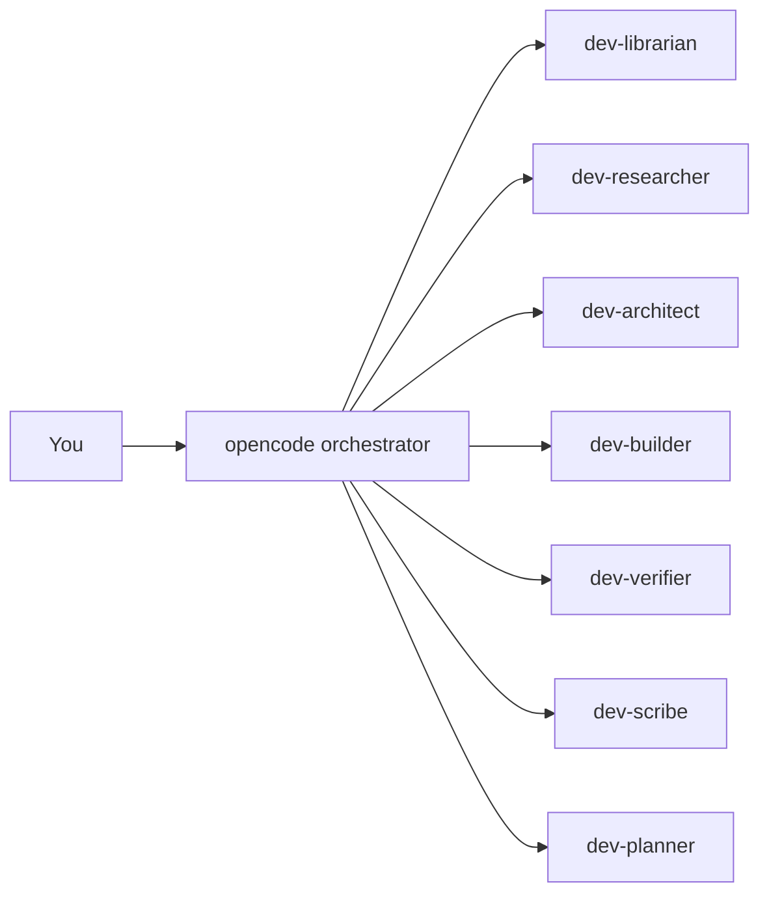
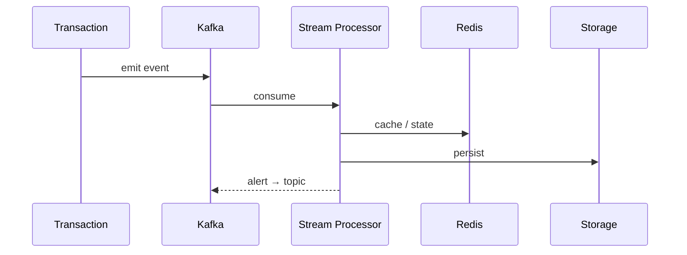

<div align="center">

```
██████╗ ████╗  ████████╗██████╗ ██╗   ██╗██╗  ██╗██████╗ ██████╗  ██████╗██╗  ██╗███████╗███╗   ██╗███████╗██╗  ██╗
██╔══██╗██╔██╗ ╚══██╔══╝██╔══██╗╚██╗ ██╔╝██║ ██╔╝██╔══██╗██╔═══██╗██╔════╝██║  ██║██╔════╝████╗  ██║██╔════╝██║ ██╔╝
██████╔╝███████╗   ██║   ██████╔╝ ╚████╔╝ █████╔╝ ██████╔╝██║   ██║██║     ███████║█████╗  ██╔██╗ ██║█████╗  █████╔╝
██╔═══╝ ██╔══██╗   ██║   ██╔══██╗  ╚═══╝  ██╔═██╗ ██╔══██╗██║   ██║██║     ██╔══██║██╔══╝  ██║╚██╗██║██╔══╝  ██╔═██╗
██║    ██║  ██║   ██║   ██║  ██║  ██╗    ██║  ██╗██████╔╝╚██████╔╝╚██████╗██║  ██║███████╗██║ ╚████║███████╗██║  ██╗
╚═╝    ╚═╝  ╚═╝   ╚═╝   ╚═╝  ╚═╝  ╚═╝    ╚═╝  ╚═╝╚═════╝  ╚═════╝  ╚═════╝╚═╝  ╚═╝╚══════╝╚═╝  ╚═══╝╚══════╝╚═╝  ╚═╝
```

**Full-stack engineer** · Python · React · FastAPI · Kafka · Redis

_I build boring, reliable systems for finance — correctness over hype._

</div>

```text
$ whoami
full-stack engineer · ex-finance/banking · deep in agentic workflows

$ cat ~/now
transaction-monitoring    real-time detection · Kafka + Redis
portly                    open-source python port mgmt · Rust core
agentic-dev               building with AI agents, not just using them

$ echo $STACK
python react fastapi kafka redis typescript rust
```

---

## Projects

**portly** — [github.com/PatrykBochenek/portly](https://github.com/PatrykBochenek/portly)
Cross-platform Python port management made simple. Check, find, scan, wait on and free TCP/UDP ports — fast, with a native Rust core and zero subprocesses.

**ai-config** — [github.com/PatrykBochenek/ai-config](https://github.com/PatrykBochenek/ai-config)
My personal AI workflow repo: opencode orchestration config, specialist `dev-*` subagents, rules, and a reproducible toolchain via mise. Building *with* agents.

**ML-based network intrusion detection** — [github.com/PatrykBochenek/Machine-Learning-Based-Network-Intrusion-Detection-System](https://github.com/PatrykBochenek/Machine-Learning-Based-Network-Intrusion-Detection-System)
ML-based intrusion detection research and implementation.

---

## How I build with agents

<details>
<summary>opencode orchestration</summary>



`portly`, `ai-config`, and this profile are built and edited with these agent workflows.

</details>

<details>
<summary>transaction monitoring flow</summary>



</details>

---

## Stack

**Backend**
`Python` · `FastAPI` · `Kafka` · `Redis` · `Rust`

**Frontend**
`React` · `TypeScript`

**Tooling**
`mise` · `Docker` · `GitHub Actions` · `opencode` · `Tailscale`

---

## Contact

```text
$ echo $EMAIL
contact@patrykbochenek.com
```
